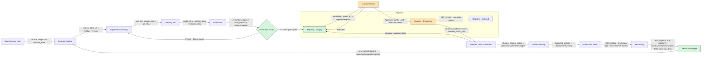

```mermaid
flowchart LR

A[Raw Delivery Data] -->|dataset snapshot + dataset_hash| B[Feature Pipeline]

B -->|feature_table_uri + feature_version| C[Experiment Tracking]

C -->|run_id + params.json + git_sha| D[Training Job]

D -->|model.onnx + metrics.json + random_seed| E[Evaluation]

E -->|evaluation_report + slice_metrics + fairness_report| F{Promotion Gates}

F -->|AUTO if gates pass| G[Registry - Staging]

F -->|Reject + failure report| C

G -->|candidate_model_uri + approval request| H[Manual Review]

H -->|Approved by ML Lead + Product Owner| I[Registry - Production]

H -->|Rejected| G

I -->|shadow_model_version + mirrored_traffic_logs| J[Shadow Traffic Validation]

J -->|shadow_latency_report + prediction_difference_report| K[Online Serving]

J -->|Shadow validation failed| G

K -->|deployed_version + deployment_config| L[Production Traffic]

L -->|latency logs + prediction logs + business KPI metrics| M[Monitoring]

M -->|drift_signal + SLA violations + courier_acceptance_drop + ETA_accuracy_drop| N[Retraining Trigger]

N -->|new training request + refreshed dataset snapshot| B

I -->|old_version + retention policy| O[Registry - Archived]

subgraph Registry
G
I
O
end

%% automatic and manual transitions
classDef auto fill:#d4f4dd,stroke:#333;
classDef manual fill:#ffe4b5,stroke:#333;

class F,G,N auto;
class H,I manual;
```
